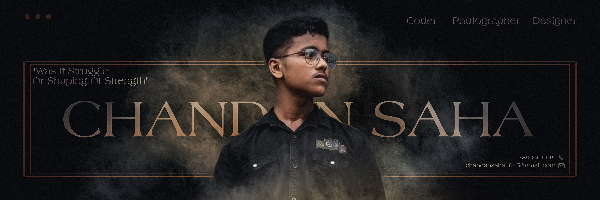
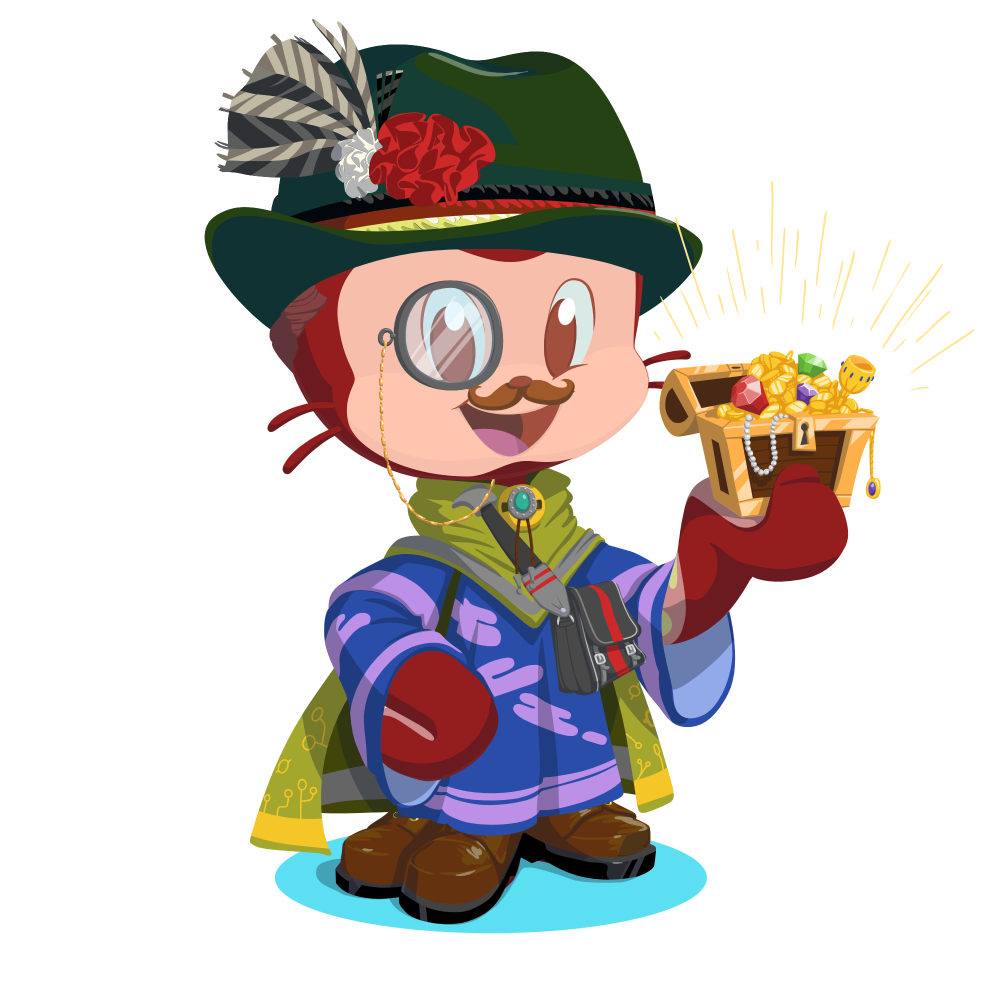
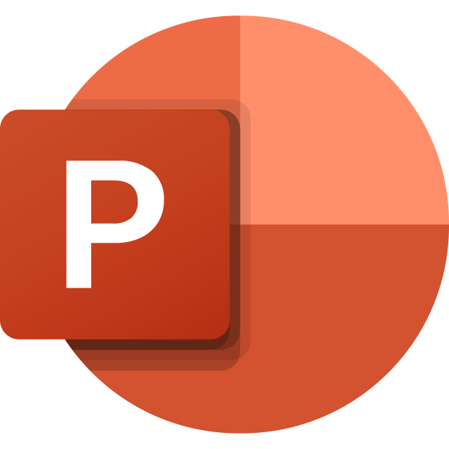

<h1 align="center">
  

    
  

  
</h1>

<table style="border: none; border-collapse: collapse;">
  <tr>
    <td width="60%" valign="top" style="border: none;">
      <h2 align="center">🌟 About Me</h2>

I’m <b>Chandan Saha</b>, a Computer Science and Engineering student pursuing my B.Tech from <b>MCKV Institute of Engineering</b>.

I enjoy solving problems, building software, and strengthening my fundamentals. A major focus of mine is <b>Data Structures and Algorithms</b>, with <b>200+ problems solved</b> across LeetCode and GeeksforGeeks.

I actively participate in <b>hackathons and programming contests</b>, where I enjoy working under pressure, collaborating with teams, and turning ideas into practical solutions.

I also care deeply about <b>design and creativity</b>. I like building things that don’t just work, but feel intuitive and intentional.

---

<h3>🏆 Achievements</h3>

- 🥇 <b>First Runner-Up</b> – CodeFiesta, Programming Contest @ MCKV Institute of Engineering  
- 🥈 <b>Second Runner-Up</b> – UDBHABON’26 Hackathon @ Jadavpur University  
- 🥈 <b>Second Runner-Up</b> – Winter Solstice Hackathon by GDG on Campus @ Meghnad Saha Institute of Technology  

    </td>

    <td width="40%" align="center" valign="middle" style="border: none;">
      
      
    </td>
  </tr>
</table>

---

<table style="border: none; border-collapse: collapse;">
  <tr>
    <td width="33%" valign="top" style="border: none;">
      <h3 align="center">💻 Programming Languages</h3>
      

        
        
        
        
        
        
        
        
      

    </td>
    <td width="33%" valign="top" style="border: none;">
      <h3 align="center">🛠️ Tools & Platforms</h3>
      

        
        
        
        
        
        
        
        
      

    </td>
    <td width="34%" valign="top" style="border: none;">
      <h3 align="center">🎨 Creative Tools</h3>
      

        
        
        
        
        
        
        
      

    </td>
  </tr>
</table>

---

<h2 align="center">📊 GitHub at a Glance</h2>

    

  

  
  

---

<h2 align="center">🧠 Beyond the Code</h2>

  I build with logic, design with intent, and learn by breaking things. 
  Code is the tool. Thinking is the skill.

  📷 Visual diary: <b>@visionbycks</b> 
  🧩 Problem solver by habit, designer by instinct.

---

<h3 align="center">🌐 Let’s Connect</h3>

  
  &nbsp;&nbsp;
  
  &nbsp;&nbsp;
  
  &nbsp;&nbsp;
  

---

  

  

