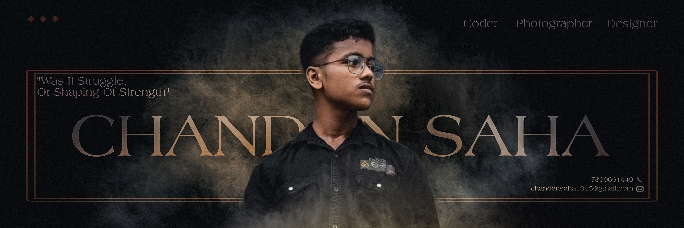

<h1 align="center">
   

  

  
</h1>

<table style="border: none; border-collapse: collapse;">
  <tr>
    <td width="60%" valign="top" style="border: none;">
      <h2 align="center">
        
      </h2>
      

        
      

      

        
      

      

        
      

      

        
      

      

        
      

    </td>
    <td width="40%" align="center" valign="middle" style="border: none;">
      
    </td>
  </tr>
</table>

---

<table style="border: none; border-collapse: collapse;">
  <tr>
    <td width="40%" align="center" valign="middle" style="border: none;">
      
    </td>
    <td width="60%" valign="top" style="border: none;">
      <h2 align="center">
        
      </h2>
      

        
      

      

        
      

      

        
      

      

        
      

    </td>
  </tr>
</table>

---

<table style="border: none; border-collapse: collapse;">
  <tr>
    <td width="50%" valign="top" style="border: none;">
      <h3 align="center">
        
      </h3>
      

        
        
        
        
        
        
        
        
      

    </td>
    <td width="50%" valign="top" style="border: none;">
      <h3 align="center">
        
      </h3>
      

        
        
        
        
        
        
        
      

    </td>
  </tr>
</table>

---

<h2 align="center">
  
</h2>

  
  
  

  

  

  
  
  
  

---

<h2 align="center">
  
</h2>

  

  

  

---

<h3 align="center">
  
</h3>

  
  &nbsp;&nbsp;
  
  &nbsp;&nbsp;
  
  &nbsp;&nbsp;
  

---

  

  

---

  

